# crach-haosexiansheng
破解好色先生协议，编写协议抓取python脚本，以及批量获取数据和视频的核心技巧
首先好色先生的网址非常好找，直接谷歌搜索：好色先生 ，因为他们会定期更换网址，所以谷歌SEO他们定期会更换，但是基本内容还是一致的。

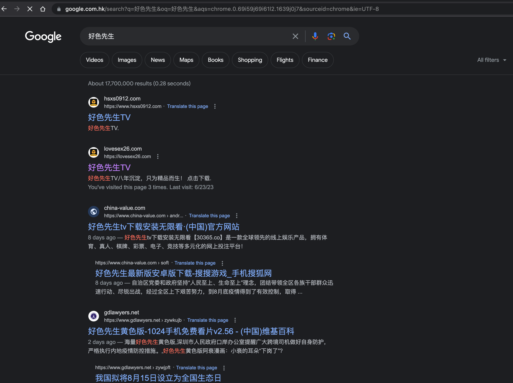

-----------------------------

### 破解前先说说这个app，这个app本身是客户付费2w以上我帮忙破解的，由于有一定的技术性，所以分享出来。本身app协议使用AES加密， 密钥通过请求初始化服务器时，会把协议解密密钥/图片解密密钥/M3U8解密密钥/TS文件解密密钥一起下发本地，然后本地在执行渲染图片和播放视频时实时解密。因为解密过程比较多，所以相对比较复杂，需要耐心一点。

# HOOK 整体破解以及抓取App所有信息流程图：

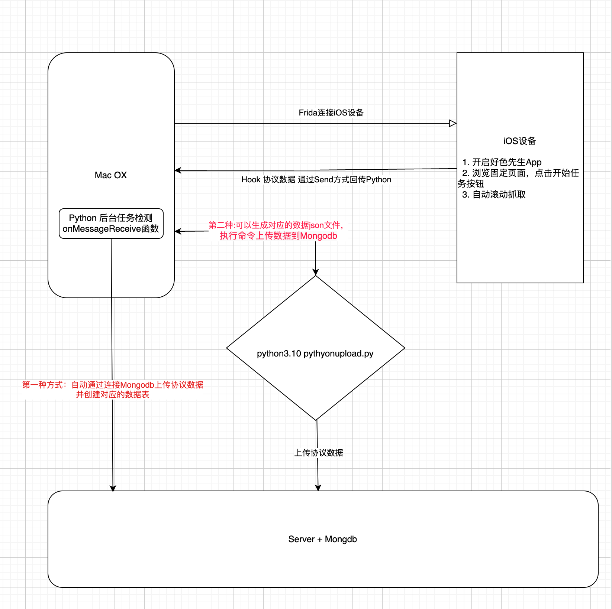


# 如何使用脚本：

### 第一种方式：
> frida -UF -l iOS_Trace.js   –no-pause


### 第二种方式：
> python3.10 custom_hook.py -f iOS_Trace.js -A 好色先生TV

如果日志太快直接输出到文件下

> python3.10 custom_hook.py -f iOS_Trace.js -A 好色先生TV > datalog/newestdatalog.txt

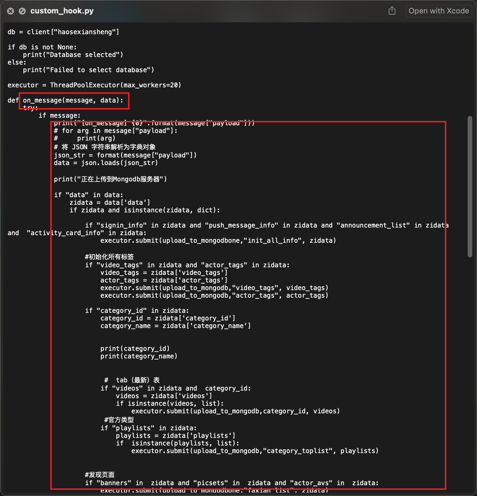

# 手动脚本上传 *.json 数据到Mangodb数据库

> python3.10  uploadToMongodb.py


文件解密iOS核心逻辑：

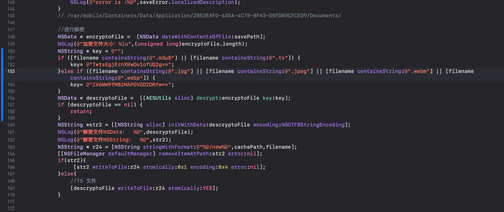
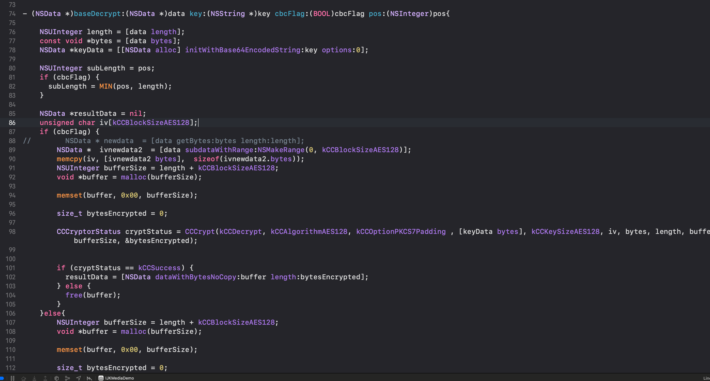

详细查看 **AESUtils.m**


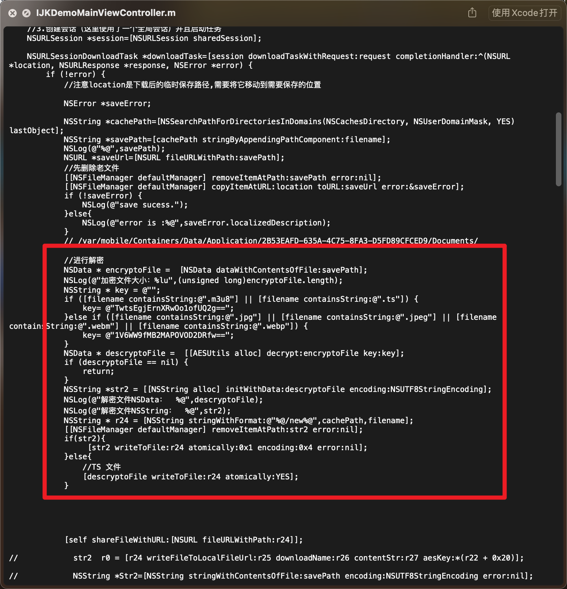
 
 

# 协议破解

#### 1：心跳破解
``` shell
[+] Caller: 0x100e8453c /var/containers/Bundle/Application/D3499BCC-B76B-47AB-98BC-90687AA9925F/xianshen.app/xianshen!+[vGrowthConnectUtils sendvGrowthHttpPost:host:path:aesKey:json:callback:errorCallback:]
[+] 参数为NSData 不显示
[+] type: NSConcreteMutableData
[+] arg3 key: qq0g6Jp2JfOHKv78q64M7w==
[+] type: __NSCFString
[+++++] 类 args[0]: AESUtils
[++++] type: AESUtils
打印hex:
base64String: YjBhZmY1ZWIgNjE0NjA0NjcgNGMzZTFlZWQgYzNiOTQ5NGEgMTZlZGE2YjggMGU2OTQ5N2IgMzkwMTgxYmIgZDczM2UxMDIgZGIwMjBiMTMgZThhMWMyNTIgOWY4ODhhY2EgMGZhODdhNGQgYTRhZTRhY2IgMzcxMWUwMWYgMzU2ZGQ1ODUgMzliM2NhYjAgNDkxYmU3ZDcgM2YzODg2NjEgNWY0Zjc1NDUgZWZkZTg1YWIgMTM3ODgzY2IgYzk1ZmYxZTAgNTc2ZTA2ZmYgMWU1MjlmYWQ=


 curl -v -X POST 'https://vapi.intcele.com/app/cmd/heartbeat' -H 'Content-Type: application/json' -H 'Cookie:' -d '(null)'
````

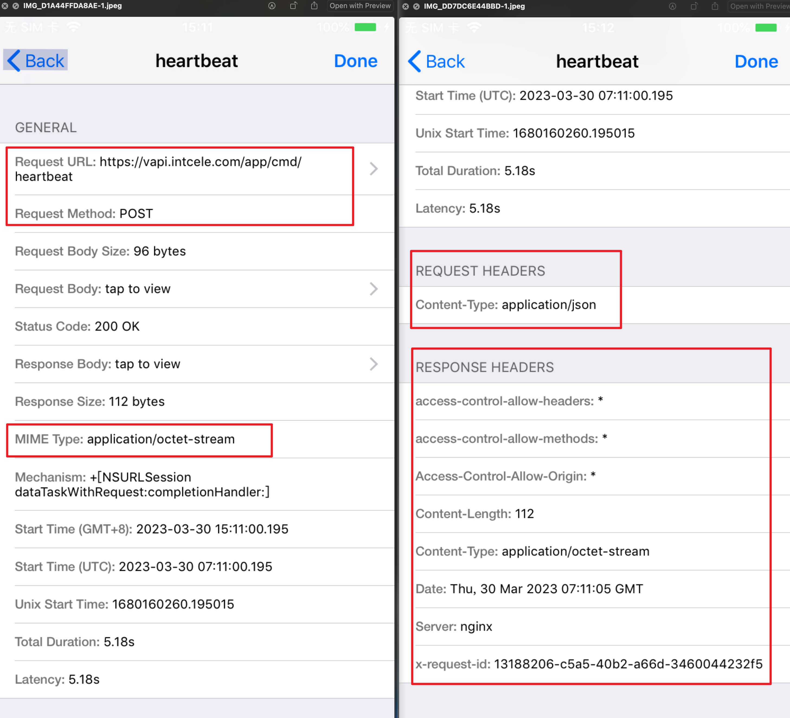

#### 2:详情见datalog目录，都是记录协议抓取的关键日志
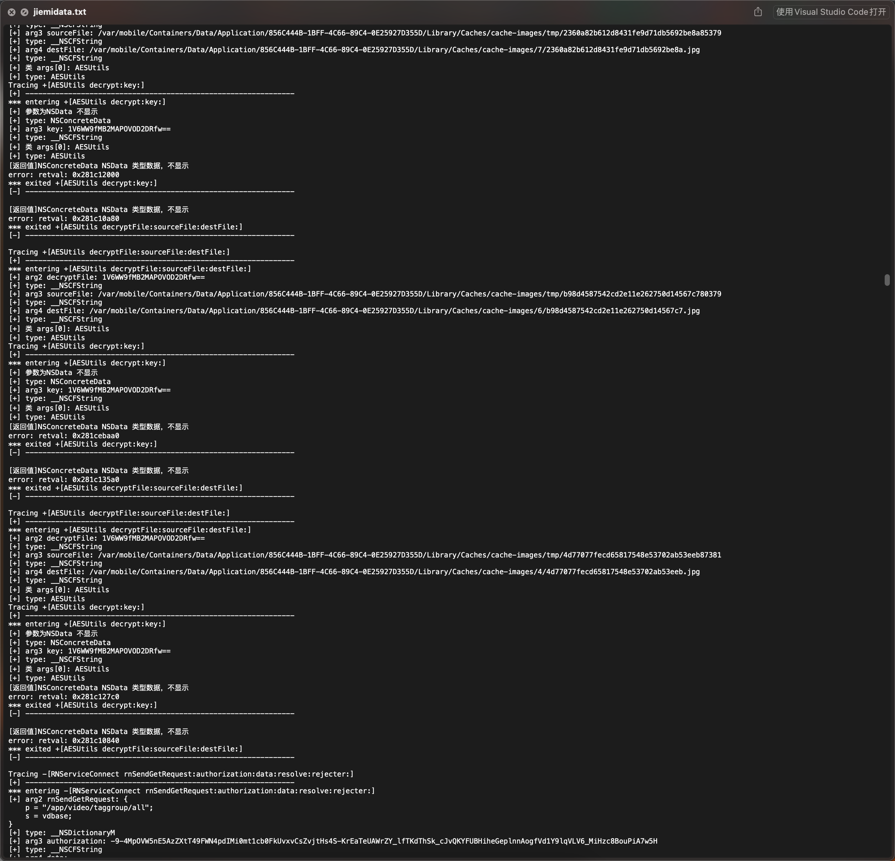

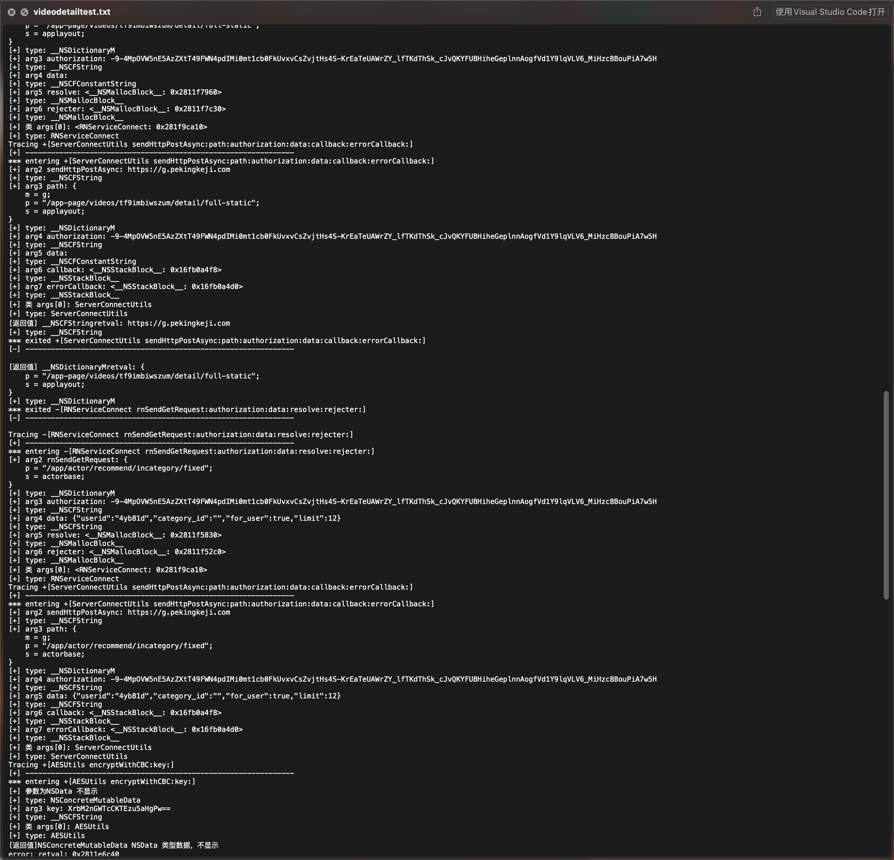

#### 爬取后的mangoDB文件:
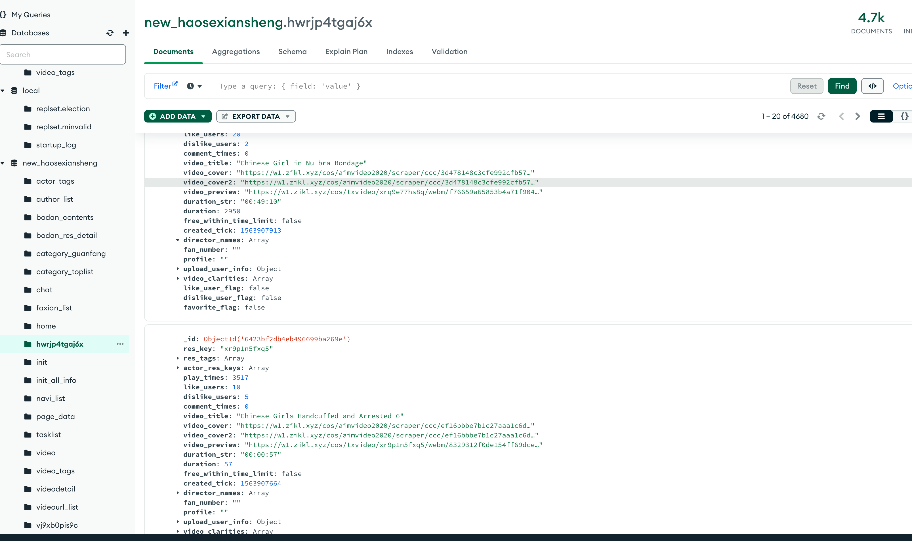
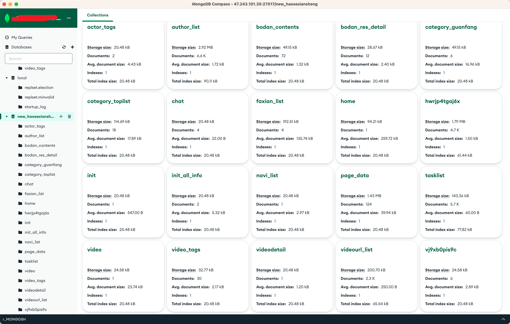

#### 附件：
 - 1: new_haosexiansheng_8ATXaw.tar.gz 是抓取所有协议数据以及m3u8下载地址的数据库文件

 - 2: Hookhaosexians目录是好色先生的插件目录，为了直接HOOK生成App视频抓取逻辑和解密逻辑，通过python+hook配合使用

 - 3: ipa文件是目标app

#### 效果图：

