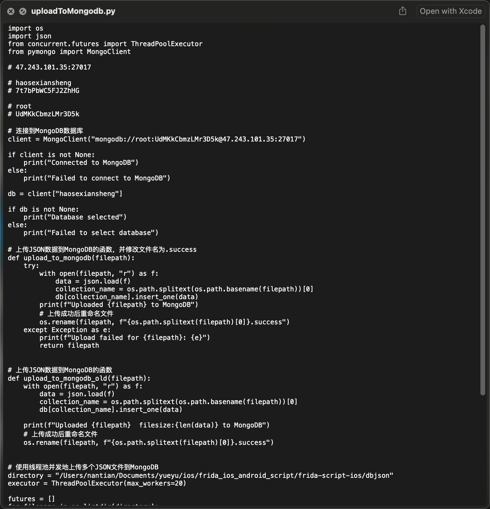
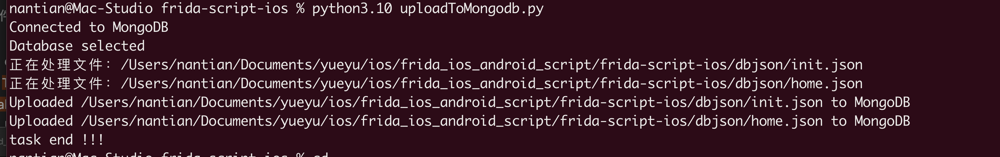

# frida-ios-dump
Pull a decrypted IPA from a jailbroken device


## Usage

 1. Install [frida](http://www.frida.re/) on device
 2. `sudo pip install -r requirements.txt --upgrade`
 3. Run usbmuxd/iproxy SSH forwarding over USB (Default 2222 -> 22). e.g. `iproxy 2222 22`
 4. Run ./dump.py `Display name` or `Bundle identifier`

For SSH/SCP make sure you have your public key added to the target device's ~/.ssh/authorized_keys file.

```
./dump.py Aftenposten
Start the target app Aftenposten
Dumping Aftenposten to /var/folders/wn/9v1hs8ds6nv_xj7g95zxyl140000gn/T
start dump /var/containers/Bundle/Application/66423A80-0AFE-471C-BC9B-B571107D3C27/AftenpostenApp.app/AftenpostenApp
start dump /private/var/containers/Bundle/Application/66423A80-0AFE-471C-BC9B-B571107D3C27/AftenpostenApp.app/Frameworks/AFNetworking.framework/AFNetworking 
start dump /private/var/containers/Bundle/Application/66423A80-0AFE-471C-BC9B-B571107D3C27/AftenpostenApp.app/Frameworks/libswiftUIKit.dylib
Generating Aftenposten.ipa

Done.
```

Congratulations!!! You've got a decrypted IPA file.

Drag to [MonkeyDev](https://github.com/AloneMonkey/MonkeyDev), Happy hacking!

## Support

Python 2.x and 3.x


### issues

If the following error occurs:

* causes device to reboot
* lost connection
* unexpected error while probing dyld of target process

please open the application before dumping.


## Frida-scripts
分享个人工作中一些事半功倍的脚本
### iOS_Trace.js
#### 说明
* 根据关键词模糊Hook Objective-C方法，在此基础上进行了修改。
* 对Objective-C的地址进行判断（防止解析出错），默认拦截所有的@id对象类型的参数和返回值，并区分着色。
* 当拦截方法较多时，为避免Hook无关的关键词造成性能问题，可以对关键词通过filter列表设置过滤。
* 关键词大小写敏感，逆向找突破口的时候可尽情发挥想象力。


### CC_Hook_2Base64.js
#### 说明 
* 由于原始CCCrypt函数的加解密结果存在原始的字节流，不方便查找和过滤，故增加Base64转化过程。
* 当KEY与IV不是明文时，以Hex形式打印，并对原始的CCCrypt函数参数进行翻译。


### CC_MD5.js
#### 说明
* 对CC_MD5函数进行拦截。  
#### 举例

### CC_SHA1.js   CCHmac.js
#### 说明
* 对CC_SHA1  CCHmac函数进行拦截。


-----------------------------

# HOOK 整体流程图：


# 如何使用脚本：
### 第一种方式：
> frida -UF -l iOS_Trace.js   –no-pause


### 第二种方式：
> python3.10 custom_hook.py -f iOS_Trace.js -A 好色先生TV

如果日志太快直接输出到文件下

> python3.10 custom_hook.py -f iOS_Trace.js -A 好色先生TV > datalog/newestdatalog.txt


# 手动脚本上传 *.json 数据到Mangodb数据库

> python3.10  uploadToMongodb.py





文件解密iOS核心逻辑：


详细查看 **AESUtils.m**


 
用户中心(权限，时间)
支付订单记录
主Tab页展示 12个
女友 +模特+主播
博单
登录注册
闪屏广告管理（倒计时5秒）
banner管理


1、成人視頻APP好色先生視頻，永久免費在線觀看！2、超快加載、海量正版高清片源，無需翻墻，支持後臺緩存下載！3、使用專用推廣碼 F9HGA9 还可以获取专属观影特权，下载请戳我 https://www.haose04.tv/vqqpd6vj.html?chan_key=downloadEx&invite_code=F9HGA9&_t=lfi0y8fd& ，部分浏览器打不开，请更换浏览器！劲爆视频，好色先生自拍自导独家AV，苍井空唯一高清无码片!


# 协议破解

#### 1：心跳破解
```
[+] Caller: 0x100e8453c /var/containers/Bundle/Application/D3499BCC-B76B-47AB-98BC-90687AA9925F/xianshen.app/xianshen!+[vGrowthConnectUtils sendvGrowthHttpPost:host:path:aesKey:json:callback:errorCallback:]
[+] 参数为NSData 不显示
[+] type: NSConcreteMutableData
[+] arg3 key: qq0g6Jp2JfOHKv78q64M7w==
[+] type: __NSCFString
[+++++] 类 args[0]: AESUtils
[++++] type: AESUtils
打印hex:
base64String: YjBhZmY1ZWIgNjE0NjA0NjcgNGMzZTFlZWQgYzNiOTQ5NGEgMTZlZGE2YjggMGU2OTQ5N2IgMzkwMTgxYmIgZDczM2UxMDIgZGIwMjBiMTMgZThhMWMyNTIgOWY4ODhhY2EgMGZhODdhNGQgYTRhZTRhY2IgMzcxMWUwMWYgMzU2ZGQ1ODUgMzliM2NhYjAgNDkxYmU3ZDcgM2YzODg2NjEgNWY0Zjc1NDUgZWZkZTg1YWIgMTM3ODgzY2IgYzk1ZmYxZTAgNTc2ZTA2ZmYgMWU1MjlmYWQ=
```

 curl -v -X POST 'https://vapi.intcele.com/app/cmd/heartbeat' -H 'Content-Type: application/json' -H 'Cookie:' -d '(null)'

-[](Snipaste_2023-03-30_15-13-18.png)